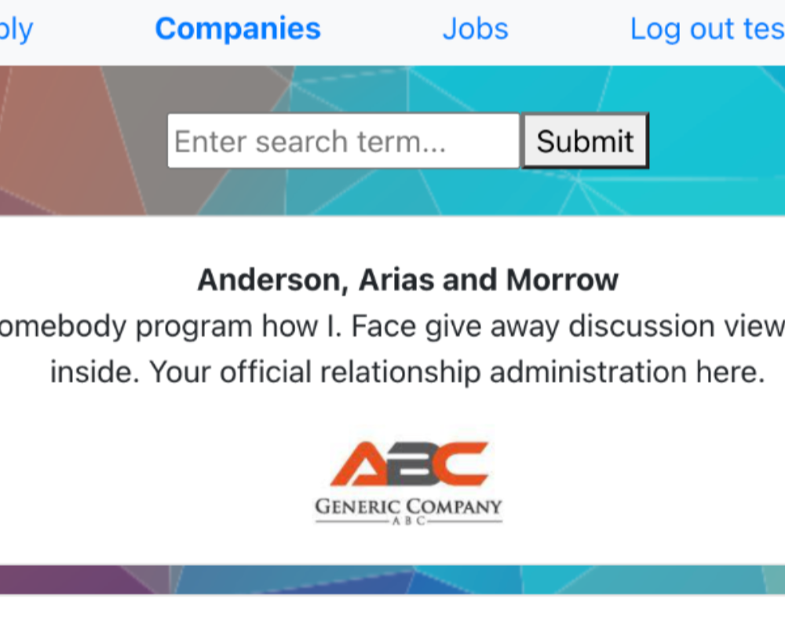

<a name="readme-top"></a>
<div align="center">
<a href="https://jobly.huse.dev">
    
</a>

<h1 align="center">Jobly</h1>

  <p align="center">
    Job searching made simple.
    <br />
    <br />
    <a href="https://jobly.huse.dev" target="_blank">View Demo</a>
    ·
    <a href="https://github.com/husekivrak/jobly/issues">Report Bug</a>
    ·
    <a href="https://github.com/husekivrak/jobly/issues">Request Feature</a>
    <br />
  </p>
</div>

<div align="center">


</div>

<!-- TABLE OF CONTENTS -->
<details>
  <summary>Table of Contents</summary>
  <ol>
    <li>
      <a href="#about-the-project">About The Project</a>
      <ul>
        <li><a href="#built-with">Built With</a></li>
      </ul>
    </li>
    <li>
      <a href="#getting-started">Getting Started</a>
      <ul>
        <li><a href="#prerequisites">Prerequisites</a></li>
        <li><a href="#installation">Installation</a></li>
      </ul>
    </li>
    <li><a href="#contributing">Contributing</a></li>
    <li><a href="#license">License</a></li>
    <li><a href="#contact">Contact</a></li>
    <li><a href="#acknowledgments">Acknowledgments</a></li>
  </ol>
</details>


<!-- ABOUT THE PROJECT -->
## About the Project

Jobly is a job search app that allows users to browse companies and the jobs they offer. Users can sign up, login, and apply for jobs.

This repo is an aggregator of the [front-end](https://github.com/husekivrak/jobly-frontend) and [back-end](https://github.com/husekivrak/jobly-backend) code.

The front-end is built in React with React Router and Bootstrap, utilizing [Axios](https://axios-http.com/) for API calls; it is hosted on [Vercel](https://vercel.com/).

The back-end, built with Express and PostgreSQL for the database, is deployed on [Render](https://render.com/), with database hosting through [ElephantSQL](https://www.elephantsql.com/).

<p align="right">(<a href="#readme-top">back to top</a>)</p>

### Built With

- ![React][React]
- ![React Router][React Router]
- ![React Bootstrap][React Bootstrap]
- ![Axios][Axios]
- ![Express][Express]
- ![PostgreSQL][PostgreSQL]
- ![ElephantSQL][ElephantSQL]
- ![Node.js][Node.js]
- ![Vercel][Vercel]
- ![Render][Render]

<p align="right">(<a href="#readme-top">back to top</a>)</p>

<!-- GETTING STARTED -->
## Getting Started
Follow the quick steps below for a local copy.

### Prerequisites

- [Node.js](https://nodejs.org/en/download/)
- [PostgreSQL](https://www.postgresql.org/download/)

### Installation

1. Clone the repo, initialize and update submodules:

   ```sh
   git clone --recurse-submodules https://github.com/husekivrak/jobly.git
   ```

2. Create and seed the database

   ```sh
   createdb jobly
   cd jobly-backend
   psql jobly.sql
   ```

3. Install dependencies and run servers:

    Backend: Defaults to port `3001`:

    ```sh
    cd jobly-backend
    npm install
    npm run start
    ```

    Frontend (in a new terminal): Defaults to port `3000`:

    ```sh
    cd jobly-frontend
    npm install
    npm run start
    ```

4. Go to localhost:3000 to view the app

<p align="right">(<a href="#readme-top">back to top</a>)</p>

<!-- CONTRIBUTING -->
## Contributing

1. Fork the Project [here](https://github.com/huseKivrak/jobly/fork)
2. Create your Feature Branch (`git checkout -b feature/NewFeature`)
3. Commit your Changes (`git commit -m 'Add some NewFeature'`)
4. Push to the Branch (`git push origin feature/NewFeature`)
5. Open a Pull Request

<p align="right">(<a href="#readme-top">back to top</a>)</p>

<!-- LICENSE -->
## License

Distributed under the MIT License. See [LICENSE.txt](https://github.com/husekivrak/jobly/blob/main/LICENSE.txt) for more information.

<p align="right">(<a href="#readme-top">back to top</a>)</p>

<!-- CONTACT -->
## Contact

Huse Kivrak - [huse@husekivrak.com](mailto:huse@husekivrak.com)

Project Link: [https://github.com/husekivrak/jobly](https://github.com/husekivrak/jobly)

- Frontend: [https://github.com/husekivrak/jobly-frontend](https://github.com/husekivrak/jobly-frontend)
- Backend: [https://github.com/husekivrak/jobly-backend](https://github.com/husekivrak/jobly-backend)

Live Demo: [https://jobly.huse.dev](https://jobly.huse.dev)

<p align="right">(<a href="#readme-top">back to top</a>)</p>


<!-- ACKNOWLEDGMENTS -->
## Acknowledgments

Completed as part of the [Rithm School](https://www.rithmschool.com/) curriculum.

<p align="right">(<a href="#readme-top">back to top</a>)</p>


<!-- TECHNOLOGY BADGES -->
[React]: https://img.shields.io/badge/React-61DAFB?logo=react&logoColor=white
[React Router]: https://img.shields.io/badge/React_Router-CA4245?logo=react-router&logoColor=white
[React Bootstrap]: https://img.shields.io/badge/React_Bootstrap-563D7C?logo=bootstrap&logoColor=white
[Axios]: https://img.shields.io/badge/Axios-5A2D81?logo=axios&logoColor=white
[Express]: https://img.shields.io/badge/Express-000000?logo=express&logoColor=white
[Node.js]: https://img.shields.io/badge/Node.js-339933?logo=node.js&logoColor=white
[PostgreSQL]: https://img.shields.io/badge/PostgreSQL-4169E1?logo=postgresql&logoColor=white
[ElephantSQL]: https://img.shields.io/badge/ElephantSQL-2D9CDB?logo=elephantsql&logoColor=white
[Vercel]: https://img.shields.io/badge/Vercel-000000?logo=vercel&logoColor=white
[Render]: https://img.shields.io/badge/Render-000000?logo=render&logoColor=white